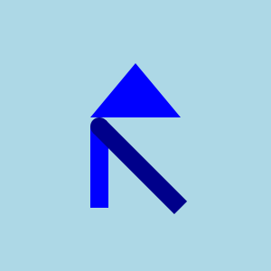
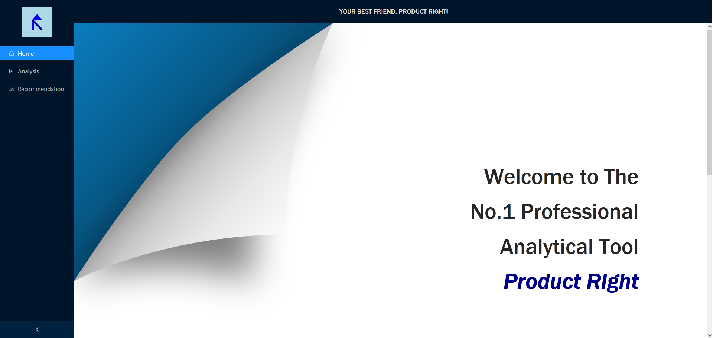
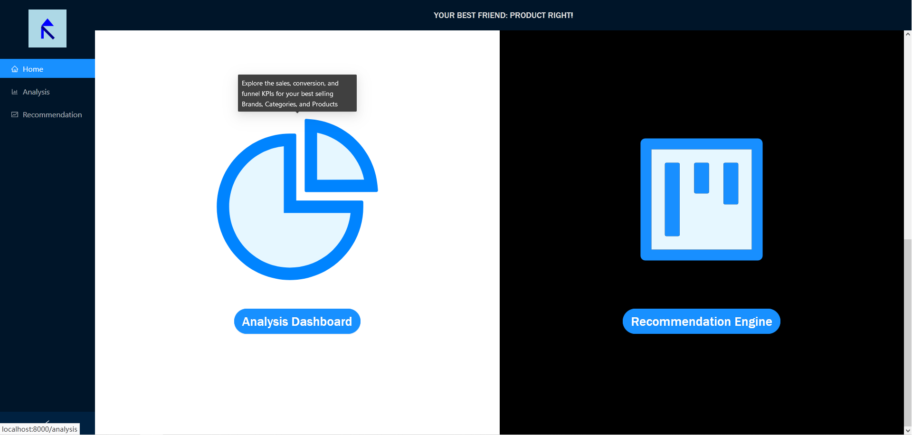
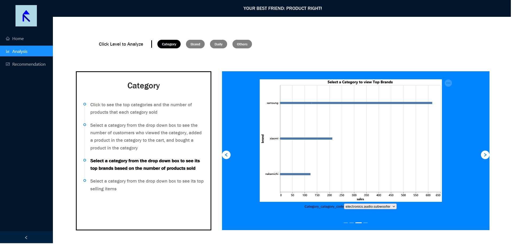
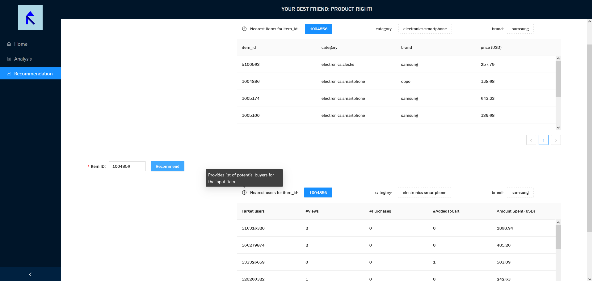
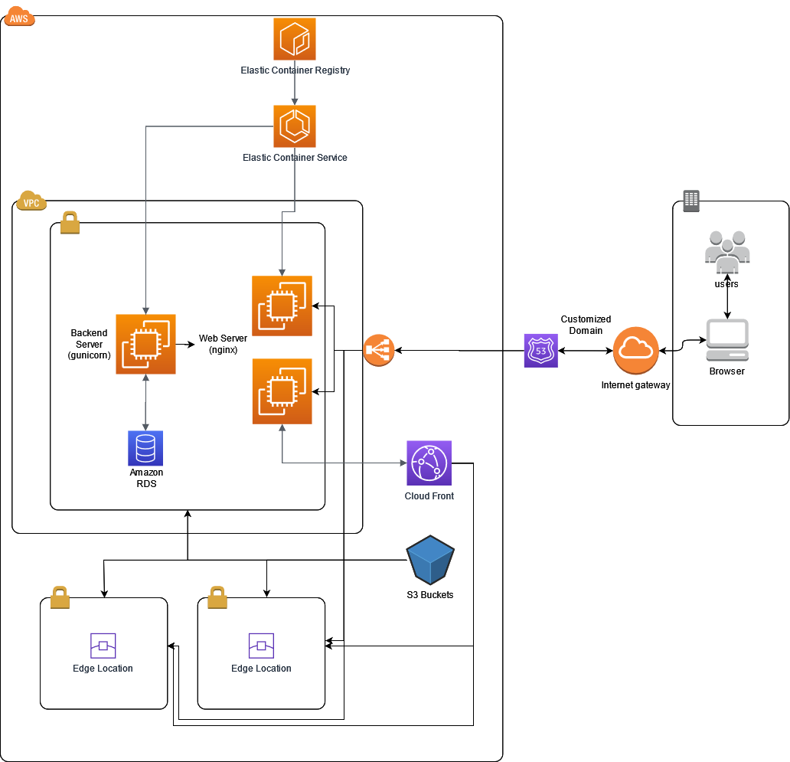

<h1 align="center">ProductRight</h1>

> A Professional Business Analysis Dashboard
----
- [Introduction](#introduction)
  - [Dataset](#dataset)
  - [Visuals](#visuals)
  - [User Story](#user-story)
- [User Tutorial :beginner:](#user-tutorial-beginner)
  - [Homepage](#homepage)
  - [Analysis Dashboard](#analysis-dashboard)
  - [Recommendation Engine](#recommendation-engine)
- [Developer Tutorial](#developer-tutorial)
  - [Architecture](#architecture)
    - [AWS Architecture](#aws-architecture)
  - [Documentation](#documentation)
  - [Test](#test)

# Introduction
`ProductRight` is a business monitoring tool that displays the Sales (Revenue, # of orders) and
Product (Conversion and Funnel) KPI’s, top selling/low selling products in each category, recommends
discount bundles of products, and trends in customer behavior. The Dashboard will provide further
drill-drown filtering at a customer cohort, category, and brand level.

## Dataset
The [dataset](https://www.kaggle.com/mkechinov/ecommerce-behavior-data-from-multi-category-store) that we are using is from a middle-eastern, multi-department ecommerce company and has
user-event level data for the months of November and October of 2019. This is an extremely relevant
dataset as competitors to Amazon are resurfacing to disrupt the market. In fact, user-event level data
also plays a significant role in most product companies that want to track customer journeys to assess
product performance and customer stickiness.

Therefore, having a real-time tracking dashboard makes
it easier for cross-functioning teams to have consistent monitoring of what is selling and how it is selling
on their website. Moreover, having a dashboard that is interactive and also provides recommendations
and insights provides business teams with more strategies to leverage and reduces the time that they
would take to arrive at these forecasts.

## Visuals
One of the interactive plots will run a recommendation engine at its backend. It will take a product’s id as
input, and it will recommend top N users that can be targeted with that product’s advertisement. User
can also select any of the recommended user’s profile and check their purchase history.

Another visualization is different levels of product sales/revenues analysis, including daily trends of individual categories/brands
sales and views in order to see areas of growth/decline.

## User Story
The primary user is a business executive (likely a logistic/ procurement manager, product manager or
marketer), of an ecommerce website who is in charge of monitoring the health of the products,
identifying gaps and successes in the ecommerce business and creating new incentives and strategies
to optimize sales.
1) As a sales & marketing team member, I want to use promotions to attract more customers based
on correlation in selling different categories of goods.
2) I am a marketing manager at my ecommerce company and am in charge of identifying the
products that are frequently viewed together so that I can design bundle discount packages to
increase acquisition. I would like this info split at a customer cohort level for personalized
marketing offers.

# User Tutorial :beginner:
## Homepage
After our warmest welcome:

</img>

You can scroll down to choose one of our services. Move your mouse to the icon, you will get detailed information:

</img>

## Analysis Dashboard
In our `Analysis` page, you can select a level you want to analyze the data on. The generated graphs and their corresponding descriptions will be shown below.

</img>

You can click on the description to navigate among graphs.

## Recommendation Engine
In our `Recommendation` page, you can type in `Item ID` you get from `Analysis` and try to find the potential users and similar items as well.

</img>

Details are explained when you move the mouse to the question mark.

**DON'T HESITATE, TRY IT NOW!**

# Developer Tutorial

## Architecture
Because our application heavily depends on `Python` for interactive dashboard and also data analysis, we are trying to build our system solely on `Python`.

For web framework, we are going to use `Flask` as our application is simple and will not contain many functions. Also our predicted throughput of the website will not be large at this point.
`React.js` will be our choice for front end to make the system look better and create a more interactive and user-friendly system.
Since most of our data are structured, we tend to use `MySQL` to store all our data to have a better performance and be easier to update.
`pytest` can provide automatic testing for constant development/ constant integration, which will also provide coverage data to help us correct our models and analyses.

We use `Altair` as the python visualization generator and connect it to `Vega` visualizer to display the analysis result.
>Data Flow: `DataManager` class fetches data from database (`csv` or `MySQL`) -> `Analyser` class has functions to analyze data (`pandas.DataFrame`) -> api endpoints contains a `data_analysis` object to get the data and analyser functions, and draws charts in different api functions to return `Vega` object to front end.

Throughout the development, we will use `Sphinx` to keep note of our functions to help future maintenance and improvement.
We will finally deploy our website onto `AWS EC2` instance to be accessible from everywhere all over the world.

If time permits, we want to have our data updated instead of remaining unchanged. So we are trying to design a web scraper to continuously fetch related data from the World Wide Web, and push them into our data repository. In that way, we can predict the future more precisely.
Also, the website itself should have better performance and allow more complicated requests and heavier loads from different users. So we will be adding authentication, more security measures, and even caches and load balancers to deal with distributed computing demands.

### AWS Architecture
</img>

Due to time and cost limit, we are not using most of all the components above, but we have plenty of abstraction to allow simple replacement with better components in the future.

## Documentation
You can view all functions and classes in our [docs](./documentation/_build/html/index.html) based on `Sphinx`.

## Test
We use `pytest` to test our codes. You can see the coverage report here:
- [Analysis part coverage report](test/CoverageReport_analysis_engine.pdf)
- [Recommendation part coverage report](test/CoverageReport_recommendation_engine.pdf)
- [Overall coverage report](test/Overall_CoverageReport.png)
